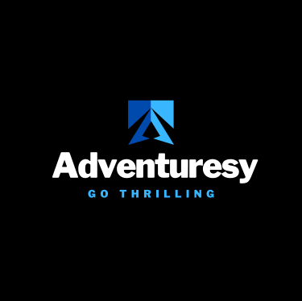

<!--
*** Thanks for checking out the Best-README-Template. If you have a suggestion
*** that would make this better, please fork the repo and create a pull request
*** or simply open an issue with the tag "enhancement".
*** Don't forget to give the project a star!
*** Thanks again! Now go create something AMAZING! :D
-->

<!-- PROJECT SHIELDS -->
<!--
*** I'm using markdown "reference style" links for readability.
*** Reference links are enclosed in brackets [ ] instead of parentheses ( ).
*** See the bottom of this document for the declaration of the reference variables
*** for contributors-url, forks-url, etc. This is an optional, concise syntax you may use.
*** https://www.markdownguide.org/basic-syntax/#reference-style-links
-->

<!-- PROJECT LOGO -->
 

  

  <h3 align="center">Adventuresy </h3>

  

    Go on thrilling and exhilarating adventures all over the globe. Reserve one today with one of our trusted partners.
     
    <a href="[https://github.com/bishalpandit/adventuresy-app](https://www.notion.so/Adventuresy-819a16326d584c4cbffd97a57bd65e66#9bbb3945fbd74ff080ed08a1dbc9d268)"><strong>Explore the docs »</strong></a>
     
     
    <a href="https:app.adventuresy.in">View Demo</a>
    ·
    <a href="https://github.com/bishalpandit/adventuresy-app/issues">Report Bug</a>
    ·
    <a href="https://github.com/bishalpandit/adventuresy-app/issues">Request Feature</a>
  

<!-- TABLE OF CONTENTS -->

  
Table of Contents

  <ol>
    <li>
      <a href="#about-the-project">About The Project</a>
      <a href="#built-with">Built With</a>
    </li>
    <li><a href="#contributing">Contributing</a></li>
    <li><a href="#contact">Contact</a></li>
  </ol>

<!-- ABOUT THE PROJECT -->
## About The Project

[![SS1][ss1]]()
  
[![SS2][ss2]]()
  
[![SS3][ss3]]()

  
Adventuresy opens possibilities for you to go on exhilarating adventures all around the globe as well as explore local hotspots by connecting you with our partners. With our advanced searching and filters, finding places of your interests becomes a piece of cake.

Adventuresy is mainly aimed for the adventurer(travellers) community who love to enjoy exhilarating adventures be it hiking at Grand Canyon or Swimming the Great Barrier Reefs. The app provides booking of adventurous activities with the help of our partners where they arrange everything for you from leaving home and coming back. We can choose from different partners from the same location who provide different facilites and price ranges.

(<a href="#top">back to top</a>)

### Built With

This section should list any major frameworks/libraries used to bootstrap your project. Leave any add-ons/plugins for the acknowledgements section. Here are a few examples.

### Frontend
* [Next.js](https://nextjs.org/)
* [React.js](https://reactjs.org/)
* [Tailwind CSS 3.0](https://tailwindcss.com)
* [Recoil](https://recoil.js.org)

### Backend
* [Node JS](https://nodjs.org)
* [Express](https://expressjs.org)
* [PostgreSQL](https://www.postgresql.org)

(<a href="#top">back to top</a>)

<!-- ROADMAP 
## Roadmap

- [x] Advanced Search and Filters
- [ ] Add Addi
- [ ] Add "components" document to easily copy & paste sections of the readme
- [ ] Multi-language Support
    - [ ] Chinese
    - [ ] Spanish

-->

See the [open issues](https://github.com/othneildrew/Best-README-Template/issues) for a full list of proposed features (and known issues).

(<a href="#top">back to top</a>)

<!-- CONTRIBUTING -->
## Contributing

Any contributions you make are **greatly appreciated**.

If you have a suggestion that would make this better, please fork the repo and create a pull request. You can also simply open an issue with the tag "enhancement".
Don't forget to give the project a star! Thanks again!

1. Fork the Project
2. Create your Feature Branch (`git checkout -b feature/AmazingFeature`)
3. Commit your Changes (`git commit -m 'Add some AmazingFeature'`)
4. Push to the Branch (`git push origin feature/AmazingFeature`)
5. Open a Pull Request

(<a href="#top">back to top</a>)

<!-- CONTACT -->
## Contact

Bishal Pandit - [@bishalpandit2602](https://linkedin.com/in/bishalpandit2602)

Project Link: [https://github.com/bishalpandit/adventuresy-app](https://github.com/bishalpandit/adventuresy-app)

(<a href="#top">back to top</a>)

<!-- MARKDOWN LINKS & IMAGES -->
<!-- https://www.markdownguide.org/basic-syntax/#reference-style-links -->
[contributors-shield]: https://img.shields.io/github/contributors/othneildrew/Best-README-Template.svg?style=for-the-badge
[contributors-url]: https://github.com/othneildrew/Best-README-Template/graphs/contributors
[forks-shield]: https://img.shields.io/github/forks/othneildrew/Best-README-Template.svg?style=for-the-badge
[forks-url]: https://github.com/othneildrew/Best-README-Template/network/members
[stars-shield]: https://img.shields.io/github/stars/othneildrew/Best-README-Template.svg?style=for-the-badge
[stars-url]: https://github.com/othneildrew/Best-README-Template/stargazers
[issues-shield]: https://img.shields.io/github/issues/othneildrew/Best-README-Template.svg?style=for-the-badge
[issues-url]: https://github.com/othneildrew/Best-README-Template/issues
[license-shield]: https://img.shields.io/github/license/othneildrew/Best-README-Template.svg?style=for-the-badge
[license-url]: https://github.com/othneildrew/Best-README-Template/blob/master/LICENSE.txt
[linkedin-shield]: https://img.shields.io/badge/-LinkedIn-black.svg?style=for-the-badge&logo=linkedin&colorB=555
[linkedin-url]: https://linkedin.com/in/othneildrew
[ss1]: public/images/screenshot.png
[ss2]: public/ss2.png
[ss3]: public/ss3.png
